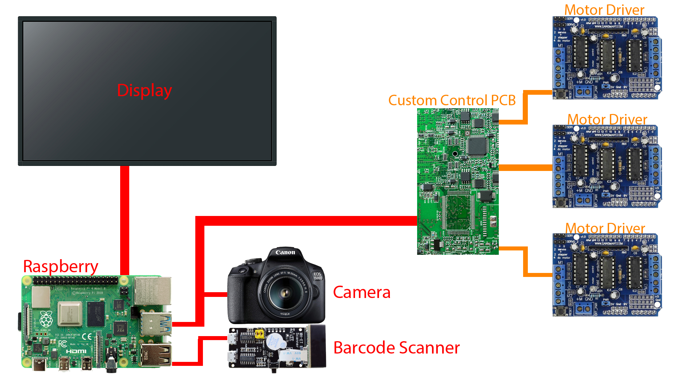

# Auto-Scanner
Automatic scanner build project.

<!-- TOC -->
## Navigation
- [Navigation](#Auto-Scanner)
    - [Requirements](#Requirements)
    - [Todo Lists](#Todo)
    - [Diagram](#BlockDiagram)
    - [Footnotes](#Footnotes)
<!-- /TOC -->

## Requirements
### Prerequisites - Code
- Java JRE 1.8
### Prerequisites - PCB
- [ ] Todo BOM list
### Prerequisites - Frame
- Machine Frame

## Todo
### Overiew
- [ ] Create GUI
- [ ] Create Frame for machine
- [ ] Create Database for storing M-Projects
- [ ] Develop PCB for driving motors

### GUI Todo Overiew
- [x] Create GUI
- [x] Create Main menu
- [ ] Create Kalibreren
- [ ] Create Manual control
- [ ] Create M-Project kiezen
- [ ] Create M-Project inleren
- [ ] Create GUI Settings
#### GUI Main menu
- [x] Create Button Kalibreren
- [x] Create Button Manual control
- [x] Create Button M-Project kiezen
- [x] Create Button M-Project inleren
- [x] Create Button Settings
- [x] Create Button Github
- [x] Create Button Debug
##### GUI Kalibreren
- [ ] Calibrate touchscreen
- [ ] Calibrate Camera
- [ ] Calibrate Scanner
##### GUI Manual control
- [ ] Move head
- [ ] Camera vision
- [ ] Scan
- [ ] Bypass
##### GUI M-Project kiezen
- [ ] List of projects
- [ ] Clickable en load from list
##### GUI M-Project inleren
- [ ] Grid of machine
- [ ] Photo of Panel
- [ ] Camera vision
- [ ] Choose locatie
- [ ] How many boards per panel
- [ ] Devider in panel per board
##### GUI Settings
- [ ] Head speed
- [ ] Scanning speed
- [ ] Scanning Settings
- [ ] Camera Settings

### Database Todo Overiew
- [ ] Create DB(Maria,MySQL)?
- [ ] Decide format to store data
- [ ] Add framework in APP to easily call and write data

## BlockDiagram

## Footnotes
### Built With

* [IntelliJ](https://www.jetbrains.com/idea/download/) - IDE used
* [Autodesk Inventor](https://www.autodesk.com/products/inventor/overview) - CAD used

### Versioning

I use [SemVer](http://semver.org/) for versioning. For the versions available.

### Authors

* [**Tariq Dinmohamed**](https://github.com/Flixis)

See also the list of [contributors](https://github.com/Flixis/Auto-Scanner/contributors) who participated in this project.

### Acknowledgments

* Shoutout to StackOverFlow without you people this would have never happenend, yes that includes the bugs you may have created.

